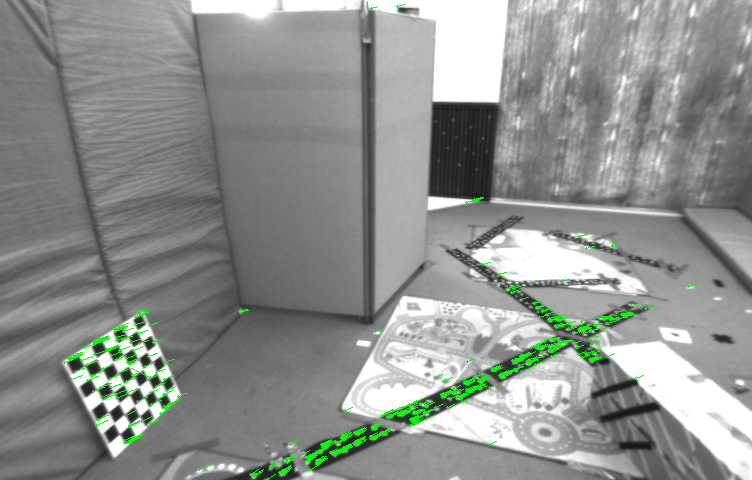

# slambook2的rust重构
本项目是对[https://github.com/gaoxiang12/slambook2]的rust重构.
很多bug😂和todo🧾, 有些实现可能比较简略😄.
已经将很多算法用rust重写了.

## 使用说明
### 工程目录
- Cargo.toml : 编译配置文件
- examples文件夹
- src文件夹
- deprecated文件夹 : 弃用的zig语言方案

Cargo.lock	README.md	deprecated	logs		reference	static		vendor
Cargo.toml	assets		examples	prebuilt	result		target		问题
LICENSE		build.sh	justfile	python		src		tools		文档链接.md

### 预构建文件
>有1000多个crate需要编译, 有可能会由于各种原因编译失败,因而提供预构建的wasm版本,理论上支持全平台.
>使用`cargo build --target wasm32-wasip1-threads --release`编译
1. 安装wasmer运行时
(理论上也支持其他运行时,例如wasmedge, wazero, wamr), 没有测试. 
参考教程[https://github.com/container2wasm/container2wasm]
```shell
# macOS/Linux
curl https://get.wasmer.io -sSfL | sh
curl https://get.wasmer.io -sSfL | sh -s "v4.3.6"
# Windows
iwr https://win.wasmer.io -useb | iex
$v="v4.3.6"; iwr https://win.wasmer.io -useb | iex
```

2. 使用wasmer运行时运行wasm二进制(仅测试了4.3.6版本)
```sh

```

## 编译
### 编译器版本
测试编译通过的编译器:
```sh
rustc --version; rustup --version; cargo --version
>rustc 1.83.0-nightly (14f303bc1 2024-10-04)
>rustup 1.27.1 (54dd3d00f 2024-04-24)
>info: This is the version for the rustup toolchain manager, not the rustc compiler.
>info: The currently active `rustc` version is `rustc 1.83.0-nightly (14f303bc1 2024-10-04)`
>cargo 1.83.0-nightly (80d82ca22 2024-09-27)
```

### 运行示例
```sh
cargo run --example ch3-coordinateTransform
cargo run --example ch3-useEigen-eigenMatrix
cargo run --example ch3-useEigen-linearEqSolution
cargo run --example ch3-useEigen-matrixExtractAssign
cargo run --example ch3-useGeometry
cargo run --example ch3-visualizeGeometry
cargo run --example ch3-plotTrajectory
cargo run --example ch4-trajectoryError
cargo run --example ch4-useSophus
cargo run --example ch4-useSophus_factrs
cargo run --example ch5-imageBasics-imageBasics
cargo run --example ch5-imageBasics-undistortImage
cargo run --example ch5-rgbd-joinMap
cargo run --example ch5-stereo-stereoVision
cargo run --example ch6-ceresCurveFitting
cargo run --example ch6-gaussNewton
cargo run --example ch6-g2oCurveFitting
cargo run --example ch7-orb_cv
cargo run --example ch7-orb_self
cargo run --example ch7-pose_estimation_2d2d
cargo run --example ch7-pose_estimation_3d2d
cargo run --example ch7-pose_estimation_3d3d
cargo run --example ch7-triangulation
cargo run --example ch8-direct_method_multi_layer
cargo run --example ch8-direct_method_single_layer
cargo run --example ch8-optical_flow
cargo run --example ch9-bundle_adjustment_ceres
cargo run --example ch9-bundle_adjustment_g2o
cargo run --example ch10-pose_graph_g2o_SE3
cargo run --example ch10-pose_graph_g2o_gs_rs
cargo run --example ch10-pose_graph_g2o_lie_algebra
cargo run --example ch11-feature_training
cargo run --example ch11-gen_vocab_large
cargo run --example ch11-loop_closure
cargo run --example ch12-dense_RGBD-octomap_mapping
cargo run --example ch12-dense_RGBD-pointcloud_mapping
cargo run --example ch12-dense_RGBD-surfel_mapping
cargo run --example ch12-dense_mono-dense_mapping
cargo run --example ch12-dense_mono-dense_mapping_image
cargo run --example ch13-myslam
```

### 使用本地crate
库文件在vendor文件夹.
1. 将库文件离线到本地:
```sh
cargo vendor
```
2. 使用本地库文件
**.cargo/config.toml**
```toml
[source.crates-io]
replace-with = "vendored-sources"

[source.vendored-sources]
directory = "vendor"
```
3. 如果遇到编译时有关库文件的报错直接修改vendor文件夹内的库文件即可.

### 效果
>输出结果在logs文件夹和result文件夹

1. **examples/ch8-direct_method_multi_layer.rs**
|结果图|
|-------------------------------------------------|
||

2. **examples/ch11-loop_closure.rs**
```log
提取训练图片的特征...
Extracting keypoint descriptors from "assets/ch11-data/8.png"
Extracting keypoint descriptors from "assets/ch11-data/9.png"
Extracting keypoint descriptors from "assets/ch11-data/10.png"
Extracting keypoint descriptors from "assets/ch11-data/4.png"
Extracting keypoint descriptors from "assets/ch11-data/5.png"
Extracting keypoint descriptors from "assets/ch11-data/7.png"
Extracting keypoint descriptors from "assets/ch11-data/6.png"
Extracting keypoint descriptors from "assets/ch11-data/2.png"
Extracting keypoint descriptors from "assets/ch11-data/3.png"
Extracting keypoint descriptors from "assets/ch11-data/1.png"
检测到 1000 个 ORB 特征。
创建词汇表...

词汇表 = Vocabulary {
    Word/Leaf Nodes: 506,
    Other Nodes: 82,
    Levels: 3,
    Branching Factor: 9,
    Total Training Features: 1000,
    Min Word Cluster Size: 1,
    Max Word Cluster Size: 25,
    Mean Word Cluster Size: 1,
    Median Word Cluster Size: 1,
}
保存词汇表...
加载词汇表...
词汇表: Vocabulary {
    Word/Leaf Nodes: 506,
    Other Nodes: 82,
    Levels: 3,
    Branching Factor: 9,
    Total Training Features: 1000,
    Min Word Cluster Size: 1,
    Max Word Cluster Size: 25,
    Mean Word Cluster Size: 1,
    Median Word Cluster Size: 1,
}
读取图片...
检测 ORB 特征...
比较图片与图片...
当前 block id: 7, 最大 block 数: 83
当前 block id: 60, 最大 block 数: 83
当前 block id: 1, 最大 block 数: 83
当前 block id: 10, 最大 block 数: 83
当前 block id: 5, 最大 block 数: 83
当前 block id: 50, 最大 block 数: 83
当前 block id: 7, 最大 block 数: 83
当前 block id: 61, 最大 block 数: 83
当前 block id: 5, 最大 block 数: 83
当前 block id: 51, 最大 block 数: 83
当前 block id: 3, 最大 block 数: 83
当前 block id: 31, 最大 block 数: 83
当前 block id: 2, 最大 block 数: 83
当前 block id: 19, 最大 block 数: 83
当前 block id: 9, 最大 block 数: 83
当前 block id: 77, 最大 block 数: 83
当前 block id: 1, 最大 block 数: 83
当前 block id: 15, 最大 block 数: 83
当前 block id: 1, 最大 block 数: 83
当前 block id: 16, 最大 block 数: 83
当前 block id: 3, 最大 block 数: 83
当前 block id: 31, 最大 block 数: 83
当前 block id: 2, 最大 block 数: 83
当前 block id: 19, 最大 block 数: 83
当前 block id: 4, 最大 block 数: 83
当前 block id: 39, 最大 block 数: 83
当前 block id: 5, 最大 block 数: 83
当前 block id: 47, 最大 block 数: 83
当前 block id: 4, 最大 block 数: 83
当前 block id: 38, 最大 block 数: 83
当前 block id: 3, 最大 block 数: 83
当前 block id: 31, 最大 block 数: 83
当前 block id: 3, 最大 block 数: 83
当前 block id: 31, 最大 block 数: 83
当前 block id: 2, 最大 block 数: 83
当前 block id: 19, 最大 block 数: 83
当前 block id: 1, 最大 block 数: 83
当前 block id: 12, 最大 block 数: 83
当前 block id: 6, 最大 block 数: 83
当前 block id: 52, 最大 block 数: 83
当前 block id: 5, 最大 block 数: 83
当前 block id: 49, 最大 block 数: 83
当前 block id: 1, 最大 block 数: 83
当前 block id: 10, 最大 block 数: 83
当前 block id: 2, 最大 block 数: 83
当前 block id: 25, 最大 block 数: 83
当前 block id: 2, 最大 block 数: 83
当前 block id: 21, 最大 block 数: 83
当前 block id: 2, 最大 block 数: 83
当前 block id: 21, 最大 block 数: 83
当前 block id: 7, 最大 block 数: 83
当前 block id: 61, 最大 block 数: 83
当前 block id: 5, 最大 block 数: 83
当前 block id: 47, 最大 block 数: 83
当前 block id: 2, 最大 block 数: 83
当前 block id: 22, 最大 block 数: 83
当前 block id: 3, 最大 block 数: 83
当前 block id: 31, 最大 block 数: 83
当前 block id: 1, 最大 block 数: 83
当前 block id: 10, 最大 block 数: 83
当前 block id: 2, 最大 block 数: 83
当前 block id: 19, 最大 block 数: 83
当前 block id: 1, 最大 block 数: 83
当前 block id: 16, 最大 block 数: 83
当前 block id: 2, 最大 block 数: 83
当前 block id: 27, 最大 block 数: 83
当前 block id: 5, 最大 block 数: 83
当前 block id: 47, 最大 block 数: 83
当前 block id: 7, 最大 block 数: 83
当前 block id: 60, 最大 block 数: 83
当前 block id: 8, 最大 block 数: 83
当前 block id: 67, 最大 block 数: 83
当前 block id: 8, 最大 block 数: 83
当前 block id: 71, 最大 block 数: 83
当前 block id: 1, 最大 block 数: 83
当前 block id: 11, 最大 block 数: 83
当前 block id: 1, 最大 block 数: 83
当前 block id: 13, 最大 block 数: 83
当前 block id: 4, 最大 block 数: 83
当前 block id: 39, 最大 block 数: 83
当前 block id: 6, 最大 block 数: 83
当前 block id: 52, 最大 block 数: 83
当前 block id: 8, 最大 block 数: 83
当前 block id: 69, 最大 block 数: 83
当前 block id: 8, 最大 block 数: 83
当前 block id: 68, 最大 block 数: 83
```
